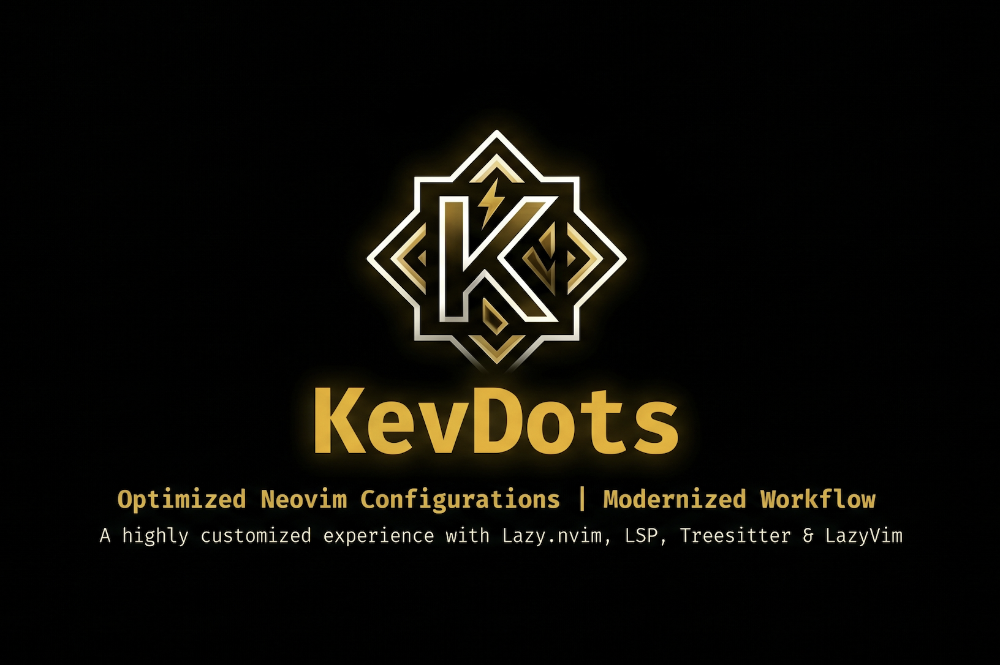

<p align="center">
  
</p>

# KevDots

Personal dotfiles for macOS and Linux — Alacritty + Zellij + LazyVim + Starship + Zsh.

Managed with [GNU Stow](https://www.gnu.org/software/stow/) for clean, symlink-based config management.

## Stack

| Tool | Purpose |
|------|---------|
| [Alacritty](https://alacritty.org) | Terminal emulator |
| [Zellij](https://zellij.dev) | Terminal multiplexer (tabs, panels) |
| [Neovim](https://neovim.io) + [LazyVim](https://lazyvim.org) | Editor |
| [Starship](https://starship.rs) | Shell prompt |
| [Zsh](https://zsh.org) + Oh My Zsh | Shell |
| [GNU Stow](https://www.gnu.org/software/stow/) | Symlink manager |
| [Claude Code](https://claude.ai/code) | AI assistant in terminal |

## Install

**macOS (Homebrew)**

```sh
brew tap KevinDM15/kevdots
brew install kevdots
kevdots install
```

**Linux / macOS (curl)**

```sh
curl -fsSL https://raw.githubusercontent.com/KevinDM15/KevDots/main/scripts/curl-install.sh | sh
```

**Manual**

```sh
git clone https://github.com/KevinDM15/KevDots.git ~/KevDots
~/KevDots/install.sh
```

The installer is an interactive TUI with these options:

- **Full install** — installs all dependencies (Homebrew/apt/pacman) and applies symlinks
- **Configs only** — applies symlinks assuming dependencies are already installed
- **Setup Claude accounts** — creates isolated folders for multiple Claude accounts
- **Backup** — saves current config to the repo and pushes to GitHub
- **Remove symlinks** — cleanly removes all KevDots symlinks from your home directory
- **Preview** — shows what will be installed before committing

## Structure

```
KevDots/
├── stow/                        # GNU Stow packages — one folder per tool
│   ├── zsh/                     # ~/.zshrc, ~/.aliases
│   ├── zsh-config/              # ~/.config/zsh/ (env, tools, prompt)
│   ├── alacritty/               # ~/.config/alacritty/
│   ├── zellij/                  # ~/.config/zellij/
│   ├── nvim/                    # ~/.config/nvim/ (LazyVim)
│   ├── starship/                # ~/.config/starship.toml
│   ├── bat/                     # ~/.config/bat/
│   ├── lsd/                     # ~/.config/lsd/
│   ├── git/                     # ~/.config/git/
│   └── claude/                  # ~/.claude/ (settings, skills, output-styles)
├── scripts/
│   ├── lib/
│   │   └── log.sh               # Shared logging utilities
│   ├── os/
│   │   ├── macos.sh             # macOS dependencies via Homebrew
│   │   └── linux.sh             # Linux dependencies via apt/pacman/dnf
│   ├── modules/
│   │   ├── stow.sh              # Apply/remove symlinks via GNU Stow
│   │   ├── backup.sh            # Save current config into stow packages
│   │   └── claude-accounts.sh  # Multi-account Claude setup
│   └── curl-install.sh          # curl entry point
├── .github/
│   └── workflows/
│       └── bump-brew.yml        # Auto-update Homebrew formula on release
├── assets/
│   └── LOGO_KEVDOTS.png
├── install.sh                   # Interactive TUI installer (entry point)
└── .gitignore
```

## How GNU Stow works

Each folder inside `stow/` mirrors the structure of `$HOME`. Running `stow zsh` creates symlinks like:

```
~/.zshrc        → ~/KevDots/stow/zsh/.zshrc
~/.aliases      → ~/KevDots/stow/zsh/.aliases
```

This means any change you make to `~/.zshrc` is immediately reflected in the repo — no manual copying needed.

## LSP Support

Configured for: TypeScript, JavaScript, Python, Go, Dart/Flutter, Lua.

Installed via LazyVim extras — servers are managed automatically by Mason.

## Claude Multi-Account

Each Claude account gets its own isolated config folder under `~/.claude-accounts/<name>`.
Aliases are generated automatically by the installer:

```sh
cl-personal     # open Claude with personal account
cl-elsol        # open Claude with El Sol account
clogin-personal # authenticate personal account
```

## Keybindings

Open the cheatsheet from the terminal:

```sh
cheat
```

## Notes

- `stow/zsh-config/.config/zsh/env.zsh` is excluded from git — it contains API keys and tokens.
- `stow/claude/.claude/mcp.json` is excluded from git — secrets are referenced via env vars.
- Homebrew formula is auto-updated on every release via GitHub Actions.
